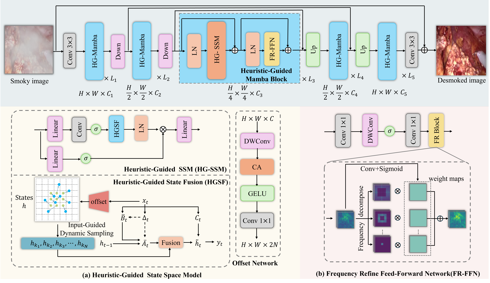

<h1 align="center">HG-Mamba</h1>

<p align="center">
  <strong>Heuristic-Guided State Space Model for Laparoscopic Image Desmoking</strong>
</p>

<p align="center">
  Shiwei Wu, Xiaobo Zhu, Song Zhang, Yu An, Xinyu Zhang, Hui Yan, Jie Tian, Xiyuan Hu, Zhenyu Liu
</p>

<p align="center">
  <em>ICME 2026</em>
</p>

<p align="center">
  <a href="https://arxiv.org/abs/xxxx.xxxxx">📄 Paper</a> |
  <a href="https://github.com/yourname/HG-Mamba">💻 Code</a> |
  <a href="https://drive.google.com/xxx">🤗 Pretrained Models</a> |
  <a href="https://xxx">📦 Dataset</a>
</p>

<p align="center">
  
  
  
  
</p>

---

## 🔥 Overview

Surgical smoke generated during laparoscopic procedures severely degrades image visibility and affects intraoperative decision-making.  
We propose **HG-Mamba**, a novel and lightweight state space model backbone for **laparoscopic image desmoking**.

HG-Mamba improves conventional Mamba from both the **spatial** and **frequency** perspectives:

- **HG-SSM**: introduces **input-guided dynamic sampling** and **heuristic-guided state fusion** for adaptive spatial context modeling.
- **FR-FFN**: performs **multi-band frequency decomposition** with adaptive weighting to enhance frequency-aware representation.

Together, these designs enable HG-Mamba to effectively remove complex surgical smoke while remaining highly lightweight.

---

## ✨ Highlights

- 🚀 A novel **Heuristic-Guided State Space Model (HG-SSM)** for flexible context modeling beyond sequential state transitions.
- 🎯 A **Frequency Refine Feed-Forward Network (FR-FFN)** for fine-grained frequency modulation.
- ⚡ **Only 1.69M parameters**, reducing parameter count by **82.45%** compared with **MambaIRv2-S (9.63M)**.
- 🏆 Superior performance on both **synthetic** and **real-world** laparoscopic desmoking benchmarks.
- 📦 A large-scale **synthetic smoke dataset** is constructed to supplement limited real paired data.

## 🏗️ Framework

<p align="center">
  
</p>

The overall architecture of our HG-Mamba-based desmoking network.

---
## 🛠️ Installation

Please follow the steps below to set up the environment.  
The code has been tested with the following configuration:

- Python 3.10.16
- CUDA 11.8
- torch==2.0.1
- torchvision==0.15.2
- torchaudio==2.0.2

### 1. Clone the repository
```bash
git clone https://github.com/ShiweiWu98/HG-Mamba.git
cd HG-Mamba
```

### 2.Create a conda environment

```bash
conda create -n HG_Mamba python=3.10.16 -y
conda activate HG_Mamba
```

### 3.Install PyTorch with CUDA 11.8

```bash
pip install torch==2.0.1 torchvision==0.15.2 torchaudio==2.0.2 --index-url https://download.pytorch.org/whl/cu118
```

### 4.Install other dependencies and selective scan kernel

```bash
pip install --upgrade pip
pip install -r requirements.txt
cd kernels/selective_scan
pip install .
```

## 📦 Dataset Preparation

Please organize the dataset in the following structure:

```bash
data/
├── train/
│   ├── smoky/         # smoky images
│   └── smokeless/     # corresponding smoke-free images with the same filenames
├── val/
│   ├── smoky/
│   └── smokeless/
└── test/
    ├── smoky/
    └── smokeless/
```

**Example:**

```
train/
├── smoky/
│   ├── 0001.png
│   ├── 0002.png
│   └── ...
└── smokeless/
    ├── 0001.png
    ├── 0002.png
    └── ...
```

## 🚀 Training

To train the model, run:

```
python common_trainer.py --config_file configs/config.yaml --mode train
```

## 🧪 Testing

To evaluate the model, run:

```
python common_trainer.py --config_file configs/config.yaml --mode test
```

------

## 🖼️ Inference

To run inference and save restored images, use:

```
python common_trainer.py --config_file configs/config.yaml --mode predict
```
